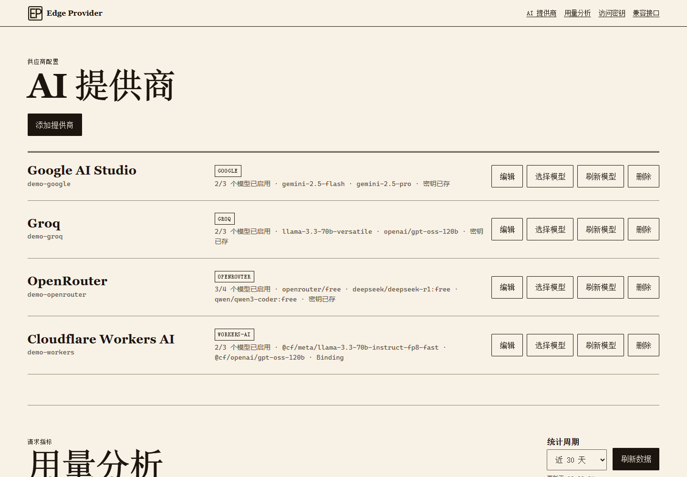
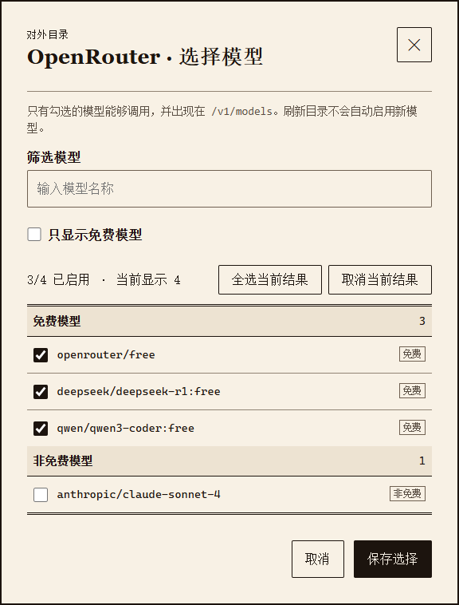

# Edge Provider

部署在 Cloudflare Workers 上的多模型 LLM API 网关：用一个 Base URL 统一接入 Gemini、Groq、OpenRouter、NVIDIA、Workers AI 等服务，并兼容 OpenAI 与 Anthropic API。

Self-hosted LLM API gateway on Cloudflare Workers. One endpoint for multiple providers, with OpenAI and Anthropic compatible APIs.

`无需 VPS` · `多 Provider` · `OpenAI Compatible` · `Anthropic Compatible` · `Streaming` · `Usage Analytics`

## Why Edge Provider

- **无需维护服务器**：运行在 Cloudflare Workers，免去 VPS 购买、系统运维和单机硬件故障。
- **一个 Base URL 接入多个厂商**：统一管理 Provider、API Key 和开放模型。
- **兼容常用协议**：支持 OpenAI Chat Completions、Responses 与 Anthropic Messages。
- **原样流式转发**：上游流式响应直接传给客户端，并在旁路记录首字延迟、TPS 和 Token。
- **模型白名单**：只向客户端暴露已勾选的模型，部分 Provider 支持只看免费模型。
- **隐私优先**：不保存 Prompt 和模型回复；统计只记录模型、Token、耗时和状态等元数据。





> 截图使用演示数据，不包含真实 API Key、域名配置或个人用量。

## 3 分钟快速开始

需要 Node.js 20+、Cloudflare 账号，以及至少一个 AI Provider 的 API Key。

```bash
git clone https://github.com/Jiao77/Edge-Provider.git
cd Edge-Provider
npm install
npx wrangler login
cp wrangler.example.jsonc wrangler.jsonc
npx wrangler kv namespace create CONFIG
npx wrangler d1 create edge-provider-usage
```

Windows PowerShell 请将复制命令改为：

```powershell
Copy-Item wrangler.example.jsonc wrangler.jsonc
```

把命令输出的 KV、D1 ID 填入 `wrangler.jsonc`，然后执行：

```bash
npx wrangler d1 migrations apply edge-provider-usage --remote
npx wrangler secret put ADMIN_TOKEN
npx wrangler deploy
```

打开 Worker 地址，用 `ADMIN_TOKEN` 登录后台并添加 Provider。完整部署、安全配置和自定义域名说明见下方。

## 兼容接口

| 接口 | 协议 | 流式传输 |
| --- | --- | --- |
| `POST /v1/chat/completions` | OpenAI Chat Completions | 支持 |
| `POST /v1/responses` | OpenAI Responses | 支持 |
| `POST /v1/messages` | Anthropic Messages | 支持 |
| `GET /v1/models` | OpenAI Models | — |

客户端使用后台生成的访问密钥：

```http
Authorization: Bearer ep_your_client_key
```

模型名使用 `供应商名称/上游模型 ID`，例如：

```json
{
  "model": "Groq/openai/gpt-oss-20b",
  "messages": [{ "role": "user", "content": "你好" }],
  "stream": true
}
```

## 支持的 Provider

| Provider | 自动获取模型 | 免费模型筛选 | 备注 |
| --- | ---: | ---: | --- |
| Google AI Studio | ✓ | — | Gemini API |
| Groq | ✓ | — | OpenAI-compatible |
| OpenRouter | ✓ | ✓ | 按价格信息识别免费模型 |
| NVIDIA NIM | ✓ | ✓ | OpenAI-compatible |
| Cloudflare Workers AI | ✓ | — | 支持 REST API Token + Account ID，也支持原生 AI Binding |
| SiliconFlow | ✓ | ✓ | OpenAI-compatible |
| 智谱 BigModel | ✓ | ✓ | OpenAI-compatible |
| Mistral | ✓ | ✓ | OpenAI-compatible |
| 自定义 OpenAI-compatible | 视上游而定 | — | 可配置 Base URL |

免费模型筛选依赖各平台模型目录返回的价格、标签或命名信息；平台规则变化时，识别结果也可能变化。是否免费及额度大小始终以上游官方说明为准。

## 管理后台

- 新增、编辑和删除 Provider
- 修改显示名称、API Key、Base URL 与 Account ID
- 自动获取模型并按分组筛选
- 勾选允许通过网关访问的模型
- 生成、自定义、禁用和删除客户端访问密钥
- 在线测试兼容接口
- 按 Provider 和模型查看 Token、请求数、成功率、首字延迟与 TPS

## 完整部署配置

### 1. 创建资源

```bash
npx wrangler kv namespace create CONFIG
npx wrangler d1 create edge-provider-usage
```

### 2. 配置 `wrangler.jsonc`

从 `wrangler.example.jsonc` 复制一份配置，将资源 ID 替换为自己的值：

```jsonc
{
  "name": "edge-provider",
  "main": "src/index.ts",
  "compatibility_date": "2026-08-25",
  "kv_namespaces": [
    { "binding": "CONFIG", "id": "YOUR_KV_NAMESPACE_ID" }
  ],
  "d1_databases": [
    {
      "binding": "USAGE",
      "database_name": "edge-provider-usage",
      "database_id": "YOUR_D1_DATABASE_ID"
    }
  ]
}
```

如果需要 Workers AI 原生 Binding，可再加入：

```jsonc
"ai": { "binding": "AI" }
```

### 3. 初始化并部署

```bash
npx wrangler d1 migrations apply edge-provider-usage --remote
npx wrangler secret put ADMIN_TOKEN
npx wrangler deploy
```

`ADMIN_TOKEN` 是后台管理员凭据。不要提交到 Git、写进前端代码，或与客户端访问密钥混用。

### 4. 绑定域名（可选）

不配置域名也可以直接使用 `*.workers.dev` 地址。自定义域名可在 Cloudflare Dashboard 的 Worker **Settings → Domains & Routes** 中添加。

## 数据与安全

- Provider API Key 保存在你自己的 Cloudflare KV 中。
- 客户端访问密钥仅保存哈希，后台不会再次展示完整值。
- Prompt、模型回复与流式内容不会写入统计数据库。
- 用量记录只包含 Provider、模型、Token、状态码、耗时、首字延迟和 TPS 等元数据。
- 建议限制后台访问、定期轮换 `ADMIN_TOKEN`，并为公开部署配置 Cloudflare Access 或 WAF 规则。

## FAQ / Limitations

### 国内访问国外 API 是否一定不需要代理？

客户端只连接 Cloudflare Worker，上游请求由 Cloudflare 边缘网络发起，因此在很多网络环境下可以减少直连国外 API 的困难。但 Cloudflare 域名、线路、地区政策和上游限制会变化，项目不能保证所有地区始终可访问。

### 无服务器是否等于不会中断？

不是。Workers 避免了自有 VPS 的硬件、系统和单机网络故障，但仍受 Cloudflare、上游 Provider、配额和区域网络状态影响。

### 免费模型是否无限使用？

不是。免费模型仍可能有每分钟请求数、Token、并发、每日额度或共享容量限制。网关不会绕过上游限流。

### 为什么没有 OpenCode Zen Provider？

OpenCode Zen 的免费额度可能与官方客户端、请求来源或反滥用策略关联。同一 API Key 从官方节点可用，但经第三方 Worker 转发时可能返回 `FreeUsageLimitError`。为避免把不稳定能力包装成可靠功能，当前不提供该预设；若上游规则变得明确，可使用自定义 OpenAI-compatible Provider 测试。

### 为什么部分流式请求的 Token 是估算值？

只有上游返回 `usage` 时才能取得精确 Token。上游未返回时，网关会在不阻塞数据转发的前提下旁路估算，因此统计值适合观察趋势，不应作为账单依据。

## 项目地址

- GitHub: https://github.com/Jiao77/Edge-Provider
- Gitea: https://gitea.jiao77.com/Jiao77/edge-provider
